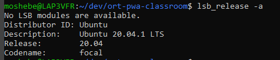

# README #

PWA Studio Installation

## Prerequisites ##

* Ubuntu 20.x
* Node Version > 12
* NPM Version > 6
* Yarn Version 1.22

## Version Testing ##

First, make sure you have a working terminal - either in your VM, MAC or Windows WSL
In the terminal, test your versions:

### Ubuntu 20.04 ###
In your terminal: 

```
lsb_release -a
```

You should get:



If you don't get version 20.04 you need to upgrade your distro or install a new version of ubuntu. if you are using a MAC this is not needed.

### Node and NPM ###
In your terminal: 
```
node -v
```
You should get:


if node is not working, or the version is lower - install nodejs using `apt`.
first, upgrade `apt-get`:
```
sudo apt-get update
sudo apt-get upgrade
```

after upgrade:
```
curl -sL https://deb.nodesource.com/setup_14.x | sudo -E bash –

```
and then:
```
sudo apt-get install nodejs
sudo apt-get install npm
```

Check versions again to make sure it worked.


### Yarn 1.22 ###

In your terminal: 
```
yarn -v
```
You should get:


If you have the wrong version or no yarn - run the lines [from this link](https://linuxize.com/post/how-to-install-yarn-on-ubuntu-20-04/):

```
curl -sS https://dl.yarnpkg.com/debian/pubkey.gpg | sudo apt-key add -
```

```
echo "deb https://dl.yarnpkg.com/debian/ stable main" | sudo tee /etc/apt/sources.list.d/yarn.list

```

```
sudo apt update
sudo apt install yarn
```

Test version again to make sure it works.


### Installing PWA Studio ###

In our bash folder we'll run:

```
yarn create @magento/pwa
```

after the installation, you will be asked several questions - pick:

  ? Project root directory (will be created if it does not exist) `ort-pwa`

  ? Short name of the project to put in the package.json "name" field (ort-pwa) `ort-pwa`

  ? Name of the author to put in the package.json "author" field `your name!`

  ? Which template would you like to use to bootstrap ort-pwa? Defaults to "@magento/venia-concept". `press enter to accept default`

  ? Magento instance to use as a backend (will be added to .env file) `pick Magento 2.4-develop`

  ? Braintree API token to use to communicate with your Braintree instance (will be added to `.env` file) `press enter to accept default`

  ? NPM package management client to use (Use arrow keys) `pick yarn`

  ? Install package dependencies with yarn after creating project (Y/n) `Y`


---
This will install our pwa react application and connect it to a cloud magento instance. now we can start developing!

go into the new folder:
```
cd ort-pwa
code .

```
This will run visual studio code in your directory, and you're all done.


### Running our developer server ###

If we want to run our app:
in our ort-pwa folder, in the terminal, run:
```
yarn watch
```

this will load our dev server with a new port, just go into the link provided in your browser. if you didn't set up an SSL link, your project will be available at:
`http://localhost:10000`


